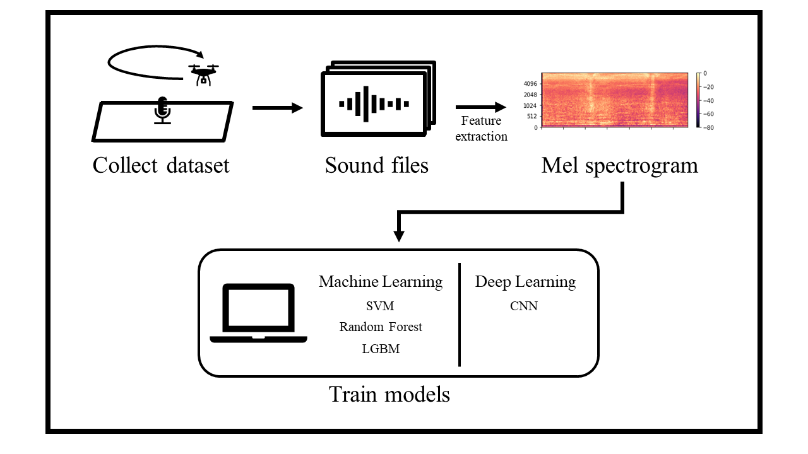

<!-- Good morning Everyone.
As all teams were created, I would ask you to update your github readme file by 30th May. It doesn't need to be perfect but it requires several parts:
(1) Group members name including all Purdue students: e.g., Minji Lee
(2) Group members univ info: e.g., Purdue University
(3) Project title
(4) Research problem statement(s)
(5) Research novelty (Significance)
(6) Overview or diagram visual(s)
(7) Environment settings (Must be very detailed with several steps. It can be updated until final weeks.)
Please reach out to me if you have any questions. Thanks. -->

# UAV Velocity Prediction Using an Acoustic Node

## Table of contents
- [Problem Statement](#problem-statement)
- [Novelty](#Novelty)
- [System Overview](#system-overview)
- [Environment Setting](#environment-setting)
- [Project Period](#project-period)
- [Authors](#Authors)


## Problem Statement
UAV (Unmanned Aerial Vehicle) can be abused by bad actors for malicious purposes. One example is a kamikaze attack where a UAV crashed into one of the electrical grid in Pennsylvania in July 2020. There are many research that published how to detect malicous UAV using cameras, radars, and lidars. However, There is little research that predict UAV velocity. Using the previously mentioned equipment will be expensive. Therefore, a microphone will be used to collect the dataset. Then, that dataset will be used to predict if a UAV exceeds our given velocity boundary.

## Novelty
1. There is very little research about predicting UAV velocity. 
    - There is many research that detects UAV using many kind of equipment. However, There is little research on detecting UAV velocity over regulation. This research is inspired by [1] that predicts any car acceleration or deceleration.
2. Acoustic data costs less and easier to get data.
    - There are many research that uses a camera, radar, lidar, or microphones to detect a UAV. This research focuses on using one microphone to collect our data, as using a microphone is cheaper than the previously mentioned equipment and is easier to collect data with it.

## System Overview

1. Microphone record slow sound and fast sound of UAV. The boundary of fast is 10 mph.
2. Recorded sound is arranged by a label that slow or fast.
3. The data extract feature uses various methods.
4. Training model that SVM, Random Forest, and LGBM for Machine Learning and CNN for Deep Learning.


## Environment Setting
- Python 3.7.0
- librosa 0.9.1
- numpy 1.20.3
- pandas 1.3.4
- sounddevice 0.4.1
- wavio 0.0.4
- sklearn 0.24.2
- pytorch 

```
pip install librosa
pip install numpy
pip install pandas
pip install sounddevice
pip install wavio
```
if your enviorment is conda,
```
conda install ...
```

## Project Period
April. 19, 2022 - August. 3, 2022

## Authors
- Eunyoung Bang
    - Kangwon National University
    - Computer Engineering
    - e_yeong@naver.com
- Jeongyoun Seo
    - Sangmyung University
    - Human Intelligence Information Engineering
    - sjo5525@naver.com
- Yeongmin Seo
    - DaeguCatholic University
    - Cyber Security
    - 1003pr@gmail.com
- Raymond Zeng
    - Purdue University
    - Cyber Security
    - zeng172@purdue.edu


## Refrence
[1] H. V. Koops and F. Franchetti, "An ensemble technique for estimating vehicle speed and gear position from acoustic data," *2015 IEEE Int. Conf. on Digit. Signal Process. (DSP)*, 2015, pp. 422-426, doi: 10.1109/ICDSP.2015.7251906.