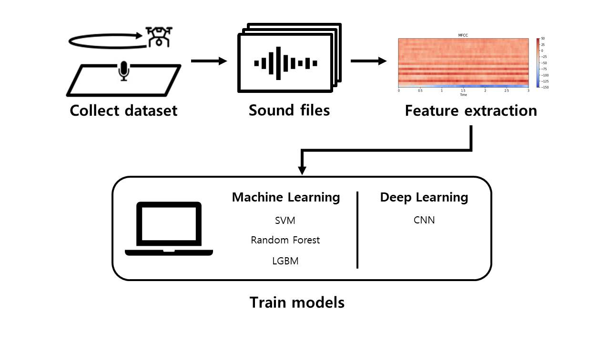

# UAV Velocity Prediction Using an Acoustic Node

## Table of contents
- [Paper and presentation matrial](#paper-and-presentation-matrial)
- [Problem Statement](#problem-statement)
- [Novelty](#Novelty)
- [System Overview](#system-overview)
- [Environment Setting](#environment-setting)
- [Usage](#usage)
- [Project Period](#project-period)
- [Authors](#Authors)

## Paper and presentation matrial
All details of this project are explained on matrials listed below.
- [MID-Paper](./PresentationAndPaper/mid_paper_060122.pdf)
- [MID-Presentation](./PresentationAndPaper/mid_presentation_052722.pdf)

## Problem Statement
UAV (Unmanned Aerial Vehicle) can be abused by bad actors for malicious purposes. One example is a kamikaze attack where a UAV crashed into one of the electrical grid in Pennsylvania in July 2020. There are many research that published how to detect malicious UAV using cameras, radars, and lidars. However, there is little research that predict UAV velocity. Using the previously mentioned equipment will be expensive. Therefore, a microphone will be used to collect the dataset. Then, that dataset will be used to predict if a UAV exceeds our given velocity boundary.

## Novelty
1. There is little research about predicting UAV velocity. 
    - There is many research that detects UAV using many kind of equipment. However, there is little research on detecting UAV velocity over regulation. This research is inspired by [1] that predicts any car acceleration or deceleration.
2. Acoustic data costs less and easier to get data.
    - There are many research that uses a camera, radar, lidar, or microphones to detect a UAV. This research focuses on using one microphone to collect our data, as using a microphone is cheaper than the previously mentioned equipment and is easier to collect data with it.

## System Overview

1. Microphone records UAV sounds, and a speed gun is used to detect the speed of the UAV (due to limitation, the speedgun used cannot detect anything under 10 mph).
2. Recorded sound is arranged by a label that slow(0-9 mph) or fast(10~ mph).
3. The data extract feature uses various methods.
4. SVM, Random Forest, LGBM was used for Machine Learning, and CNN was used for Deep Learning.

## Environment Setting
- Python 3.7.0
- librosa 0.9.1
- numpy 1.20.3
- pandas 1.3.4
- sounddevice 0.4.1
- wavio 0.0.4
- sklearn 0.24.2
- lightgbm 3.3.2
- pytorch 1.11


```
pip install librosa
pip install numpy
pip install pandas
pip install sounddevice
pip install wavio
pip install sklearn
pip install lightgbm
```

## Usage
You can use wav file dataset collected in person. After colleting dataset, you can train a model with a command below.
## Training a Machine Learning models
```
python MachineLearning.py
```
## Training a CNN model
```
python train.py -lr [learning rate] -batch [batch] -epochs [training epoch] -dataset [dataset path]
```
- example
```
train.py -lr 0.001 -batch 128 -epochs 50 -dataset ./dataset
```
## Inferencing with a trained model
You can check the trained model accuracy with a command below.
```
python train.py --test -model_weights [path]
```
- example
```
python train.py --test -model_weights ./models/cnn_model_0.94
```
## Project Period
April. 19, 2022 - August. 3, 2022

## Authors
- Eunyoung Bang
    - Kangwon National University
    - Department of Computer Science and Engineering
    - e_yeong@naver.com
- Yeongmin Seo
    - DaeguCatholic University
    - Cyber Security
    - 1003pr@gmail.com
- Jeongyoun Seo
    - Sangmyung University
    - Human Intelligence Information Engineering
    - sjo5525@naver.com
- Raymond Zeng
    - Purdue University
    - Cyber Security
    - zeng172@purdue.edu
- Aminata Niang
    - Institut Polytechnique de Paris
    - Network and Computer Engineering
    - aminatabinetabibiniang@gmail.com

## Refrence
[1] H. V. Koops and F. Franchetti, "An ensemble technique for estimating vehicle speed and gear position from acoustic data," *2015 IEEE Int. Conf. on Digit. Signal Process. (DSP)*, 2015, pp. 422-426, doi: 10.1109/ICDSP.2015.7251906.